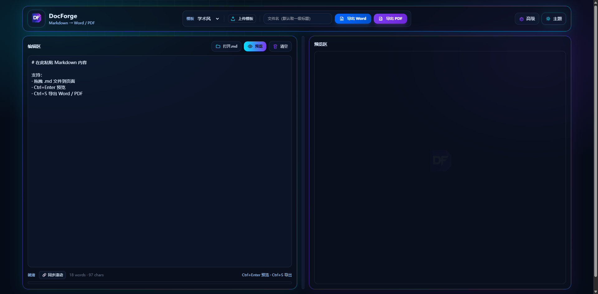
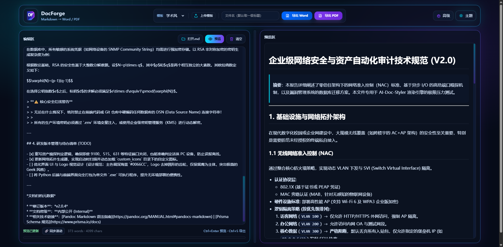
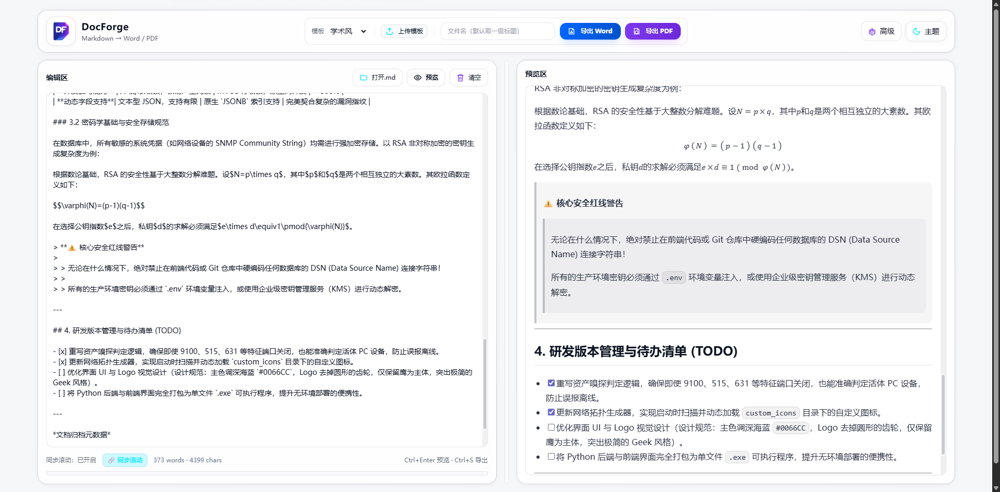

# DocForge

**专为 AI 时代打造的极客风 Markdown 文档锻造引擎 | 纯 Web 端一键导出 Word / PDF**

DocForge 是一款专为开发者、安全工程师及技术极客打造的在线排版与转换工具。无论你是专注手写技术文档，还是需要**将 ChatGPT、Claude 等大模型（LLM）生成的 Markdown 内容快速变现**，只需一键粘贴，即可瞬间将原始文本锻造为排版严谨、格式完美的商业级 Word 和 PDF 文件。

> 🚀 **立即体验：** [https://doc.cyber-sec.run](https://doc.cyber-sec.run)

## ✨ 核心特性

* **🤖 完美接轨 AI 创作**：专为清洗和重排大模型生成的 Markdown 文本而生。无论 AI 生成的代码块、复杂表格、数学公式还是嵌套列表，粘贴即刻完美渲染，彻底告别手动二次排版的痛苦。
* **⚡ 开箱即用，拒绝繁琐**：纯 Web 端原生体验，无需在本地死磕配置 LaTeX 环境、排版参数或安装任何底层依赖。
* **🎨 多范式模板支持**：内置“学术风（三线表）”、“公文风”、“互联网风”等标准排版，并支持直接上传你的专属 `.docx` 模板进行像素级样式继承。
* **🎯 精准还原，告别乱码**：底层渲染引擎经过深度调优，彻底解决常规转换工具中常见的 TODO 框乱码、表格缺线等痛点，实现向 Word/PDF 的 100% 无损转换。
* **💻 沉浸式极客体验**：深度定制的 Dark Mode 暗黑主题，支持双屏同步滚动渲染，全键盘快捷键覆盖，提供极致流畅的写作心流。
* **🔒 隐私优先，安全隔离**：秉承信息安全底线，采用会话隔离与无痕处理机制。服务器不保留全局转换历史，不落盘存储敏感内容，放心处理高危审计报告与内部文档。

## 📸 界面预览

 

 

 

## ⌨️ 快捷操作

* `Ctrl + Enter`：触发右侧实时预览
* `Ctrl + S`：一键调起文档导出
* 拖拽 `.md` 文件至浏览器即可快速解析

---
Crafted with ⚡ by **Lucius**.
